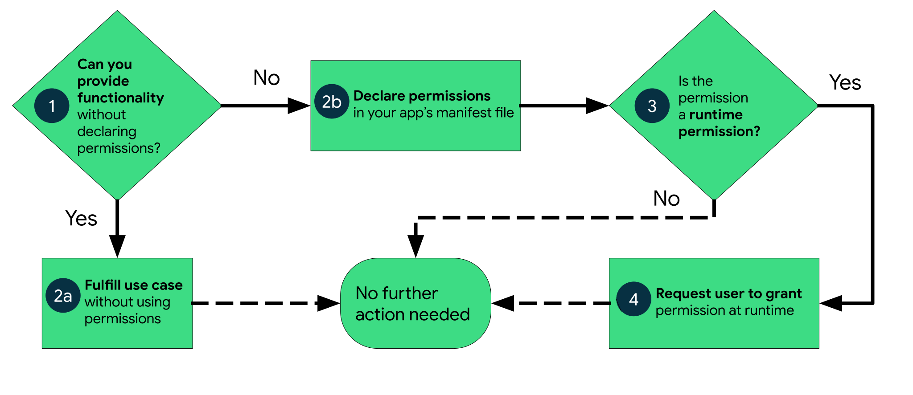

https://developer.android.com/guide/topics/permissions/overview
Permissions on Android

앱 권한은 사용자의 privacy를 지켜주는데 도움을 준다.
- 시스템 상태나 연락처와 같은 정보 접근 제한
- 다른 디바이스나 연결하거나 녹음 하는 등의 동작을 제한

이 페이지의 제공 정보, 권한을 획득, 처리 하는 '절차', 권한의 다른 타입들 설명, best practice.

다른 페이지에서는 권한 요청, 선언 등에 대한 '최소화' 방법과, 다른 앱들과의 상호작용을 어떻게 '제한' 하는지 알려줌.

## [Workflow for using permissions](https://developer.android.com/guide/topics/permissions/overview#workflow)
제한된 동작이나 데이터에 접근하려고 할 때 권한을 필요로 하는지 파악 해야함. 사진, 미디어 등의 정보들을 권한없이 가져오는 방법도 있기에 
기능을 구현시 이 방법을 사용 가능한지 고려한다.
그렇지 않다면 권한을 선언해서 데이터에 접근하는 방법을 선택해야 한다. 여기에서도 어떤 권한들은 앱 설치 시 자동으로 부여되는 '인스톨 타임 퍼미션' 이 있고,
앱 실행중에 권한을 얻어야 하는 '런타임 퍼미션'이 있다.

## [Types of permissions](https://developer.android.com/guide/topics/permissions/overview#types)
설치시, 런타임시, 특별권한 으로 권한이 나뉨

### [Install-time permissions](https://developer.android.com/guide/topics/permissions/overview#install-time)
앱스토어에서 앱 설치 전 사용하는 권한들을 확인

### [Normal permissions](https://developer.android.com/guide/topics/permissions/overview#normal)
사용자 개인정보에 아주 적은 리스크를 갖음
### [Signature permissions](https://developer.android.com/guide/topics/permissions/overview#signature)
앱또는 OS에서 정의한 권한과 똑같을 때 시스템에서 권한을 허용 함.
### [Runtime permissions](https://developer.android.com/guide/topics/permissions/overview#runtime)

### [Special permissions](https://developer.android.com/guide/topics/permissions/overview#special)
### [Permission groups](https://developer.android.com/guide/topics/permissions/overview#groups)

## [Best practices](https://developer.android.com/guide/topics/permissions/overview#best-practices)

### [Request a minimal number of permissions](https://developer.android.com/guide/topics/permissions/overview#minimal-number)
### [Associate runtime permissions with specific actions](https://developer.android.com/guide/topics/permissions/overview#associate-with-actions)
### [Consider your app's dependencies](https://developer.android.com/guide/topics/permissions/overview#minimal-number)
### [Be transparent](https://developer.android.com/guide/topics/permissions/overview#minimal-number)
### [Request a minimal number of permissions](https://developer.android.com/guide/topics/permissions/overview#minimal-number)